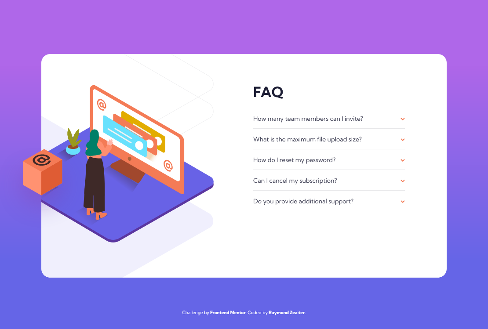

# Frontend Mentor - FAQ accordion card solution

This is a solution to the [FAQ accordion card challenge on Frontend Mentor](https://www.frontendmentor.io/challenges/faq-accordion-card-XlyjD0Oam). Frontend Mentor challenges help you improve your coding skills by building realistic projects.

## Table of contents

- [Overview](#overview)
  - [The challenge](#the-challenge)
  - [Screenshot](#screenshot)
  - [Links](#links)
- [My process](#my-process)
  - [Built with](#built-with)
  - [What I learned](#what-i-learned)
  - [Useful resources](#useful-resources)
- [Author](#author)

**Note: Delete this note and update the table of contents based on what sections you keep.**

## Overview

### The challenge

Users should be able to:

- [x] View the optimal layout for the component depending on their device's screen size
- [x] See hover states for all interactive elements on the page
- [x] Hide/Show the answer to a question when the question is clicked

### Screenshot

### Links

- Solution URL: [https://github.com/king-oldmate/frontendmentor-faq-accordion-card/](https://github.com/king-oldmate/frontendmentor-faq-accordion-card)
- Live Site URL: [https://king-oldmate.github.io/frontendmentor-faq-accordion-card/](https://king-oldmate.github.io/frontendmentor-faq-accordion-card/)

## My process

### Built with

- Semantic HTML5 markup
- CSS custom properties
- Flexbox
- Mobile-first workflow

### What I learned

I learnt how to properly make images responsive using `srcset`.

### Useful resources

- [A Guide to the Responsive Images Syntax in HTML ](https://css-tricks.com/a-guide-to-the-responsive-images-syntax-in-html/#using-picture)

## Author

- Website - [Raymond Zeaiter](https://raymond-zeaiter.au)
- Frontend Mentor - [@king-oldmate](https://www.frontendmentor.io/profile/king-oldmate)
- Twitter - [@RayZeaiter](https://www.twitter.com/RayZeaiter)

**Note: Delete this note and add/remove/edit lines above based on what links you'd like to share.**
